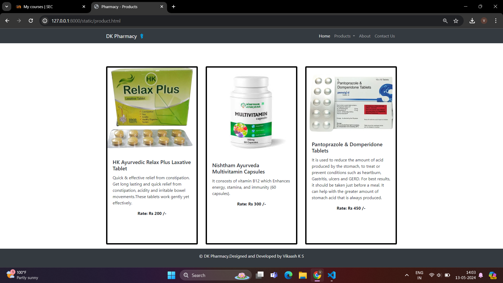
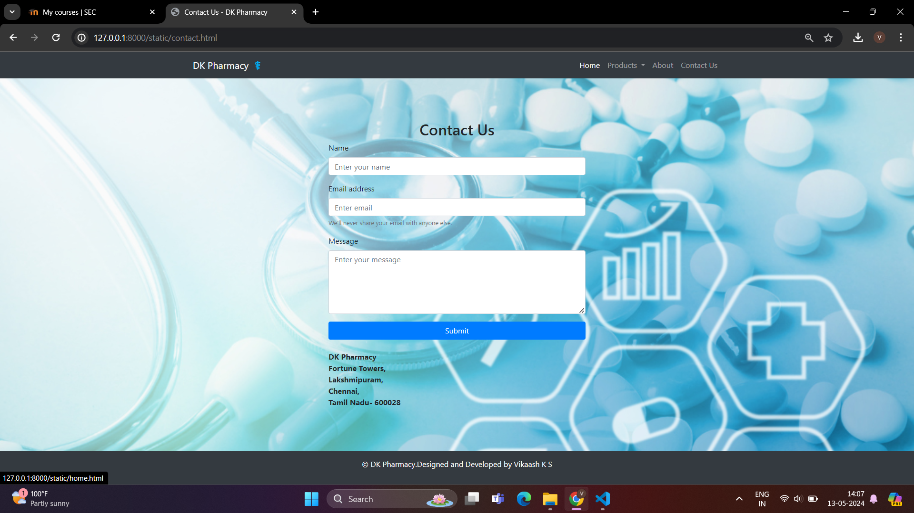

# Project Responsive Web Design using Bootstrap
## Date:13.05.2024

## AIM:
To design a responsive website for a Pharmaceutical Company using Bootstrap.


## DESIGN STEPS:

### Step 1:
Clone the repository from GitHub.

### Step 2:
Create Django Admin project.

### Step 3:
Create a New App under the Django Admin project.

### Step 4:
Insert the necessary CSS and JavaScript files as external in order to use Bootstrap.

### Step 5:
Create a HTML file and include the needed Bootstrap components.

### Step 6:
Publish the website in the LocalHost.

## PROGRAM :
```
home.html

<!DOCTYPE html>
<html lang="en">

<head>
    <meta charset="UTF-8">
    <meta name="viewport" content="width=device-width, initial-scale=1.0">
    <title>Pharmacy - Home</title>
    <link rel="stylesheet" href="https://stackpath.bootstrapcdn.com/bootstrap/4.5.2/css/bootstrap.min.css">
</head>

<body>
    <header>
        <nav class="navbar navbar-expand-lg navbar-dark bg-dark fixed-top">
            <div class="container">
                <a class="navbar-brand" href="#">DK Pharmacy ⚕️</a>
                <button class="navbar-toggler" type="button" data-toggle="collapse" data-target="#navbarNav"
                    aria-controls="navbarNav" aria-expanded="false" aria-label="Toggle navigation">
                    <span class="navbar-toggler-icon"></span>
                </button>
                <div class="collapse navbar-collapse" id="navbarNav">
                    <ul class="navbar-nav ml-auto">
                        <li class="nav-item active">
                            <a class="nav-link" href="home.html">Home</a>
                        </li>
                        <li class="nav-item dropdown">
                            <a class="nav-link dropdown-toggle" href="product.html" id="navbarDropdown" role="button" data-toggle="dropdown" aria-haspopup="true" aria-expanded="false">
                                Products
                            </a>
                            <div class="dropdown-menu" aria-labelledby="navbarDropdown">
                                <a class="dropdown-item" href="product.html" >Ayurveda</a>
                                <a class="dropdown-item" href="product.html">Skin Care</a>
                                <a class="dropdown-item" href="product.html">Multivitamins</a>
                            </div>
                        </li>
                        <li class="nav-item">
                            <a class="nav-link" href="about.html">About</a>
                        </li>
                        <li class="nav-item">
                            <a class="nav-link" href="contact.html">Contact Us</a>
                        </li>
                    </ul>
                </div>
            </div>
        </nav>
    </header>

    <div class="container mt-5">
        <div class="row">
            <div class="col-md-6">
                <br>
                <h1>Welcome to Our DK Pharmacy</h1>
                
            </div>
            
            <div class="col-md-6">
                <p class="lead" style="font-weight: bold;"> <br> <strong> We provide high-quality pharmaceutical products to our customers.</strong> 
                </p>
                <p>
                    DK Pharmacy is a subsidiary of DK Hospitals, a highly regarded pharmacy chain in India. It is the largest and first-ever Omni-Channel Pharmacy network in Asia, with a vast network of over 5500 outlets strategically located in key locations across the country. The delivery service covers over 19000+ pin codes, making it highly accessible to people throughout India.
                </p>
                <p>
                    The pharmacy is accredited with an International Quality Certification, which speaks to its commitment to providing authentic and reasonably priced medication round the clock. The 24-hour pharmacies and home delivery network are designed to ensure customers' convenience, while the customer care is available at any time of the day.
                </p>
                <p>
                    Quality is the foundation of DK Pharmacy's operations. Over the last two decades, the pharmacy has gained extensive experience in pharmacy operations management, and it is dedicated to offering the best services in the industry. The pharmacy is adequately stocked with a comprehensive range of medicines, over-the-counter (OTC), and fast-moving consumer goods (FMCG) products. The qualified and experienced staff are available to address all your needs.
                </p>
    
            </div>
            <body style="background-image: url('Pharmabg.png'); background-size: cover; background-repeat: no-repeat;">

        </div>
    </div>

    <footer class="bg-dark text-white text-center py-3 fixed-bottom">
        <div class="container">
            <p>&copy;DK Pharmacy.Designed and Developed by Vikaash K S</p>
        </div>
    </footer>

    <script src="https://code.jquery.com/jquery-3.5.1.slim.min.js"></script>
    <script src="https://cdn.jsdelivr.net/npm/@popperjs/core@2.5.3/dist/umd/popper.min.js"></script>
    <script src="https://stackpath.bootstrapcdn.com/bootstrap/4.5.2/js/bootstrap.min.js"></script>
</body>
</html>

product.html

<!DOCTYPE html>
<html lang="en">

<head>
    <meta charset="UTF-8">
    <meta name="viewport" content="width=device-width, initial-scale=1.0">
    <title>Pharmacy - Products</title>
    <link rel="stylesheet" href="https://stackpath.bootstrapcdn.com/bootstrap/4.5.2/css/bootstrap.min.css">
</head>
<style>
     .product-card {
    height: 680px; 
    border: 5px solid black; 
    margin-bottom: 40px;
}

</style>

<body>
    <header>
        <nav class="navbar navbar-expand-lg navbar-dark bg-dark fixed-top">
            <div class="container">
                <a class="navbar-brand" href="#">DK Pharmacy ⚕️</a>
                <button class="navbar-toggler" type="button" data-toggle="collapse" data-target="#navbarNav"
                    aria-controls="navbarNav" aria-expanded="false" aria-label="Toggle navigation">
                    <span class="navbar-toggler-icon"></span>
                </button>
                <div class="collapse navbar-collapse" id="navbarNav">
                    <ul class="navbar-nav ml-auto">
                        <li class="nav-item active">
                            <a class="nav-link" href="home.html">Home</a>
                        </li>
                        <li class="nav-item dropdown">
                            <a class="nav-link dropdown-toggle" href="product.html" id="navbarDropdown" role="button" data-toggle="dropdown" aria-haspopup="true" aria-expanded="false">
                                Products
                            </a>
                            <div class="dropdown-menu" aria-labelledby="navbarDropdown">
                                <a class="dropdown-item" href="product.html" >Ayurveda</a>
                                <a class="dropdown-item" href="product.html">Skin Care</a>
                                <a class="dropdown-item" href="product.html">Multivitamins</a>
                            </div>
                        </li>
                        <li class="nav-item">
                            <a class="nav-link" href="about.html">About</a>
                        </li>
                        <li class="nav-item">
                            <a class="nav-link" href="contact.html">Contact Us</a>
                        </li>
                    </ul>
                </div>
            </div>
        </nav>
    </header>
        <br> <br> <br> <br>
    <div class="container mt-5">
        <div class="row">
            <div class="col-md-4">
                <div class="card product-card">
                    
                    <div class="card-body">
                        <h5 class="card-title">HK Ayurvedic Relax Plus Laxative Tablet</h5>
                        <p class="card-text">Quick & effective relief from constipation. Get long lasting and quick relief from constipation, acidity and irritable bowel movements.These tablets work gently yet effectively.
                        </p>
                        <p class="card-text" align="center"> <b>Rate: Rs 200 /- </b></p>
                    </div>
                </div>
            </div>
            <div class="col-md-4">
                <div class="card product-card">
                    
                    <div class="card-body">
                        <h5 class="card-title">Nishtham Ayurveda Multivitamin Capsules </h5>
                        <p class="card-text">It consosts of vitamin B12 which Enhances energy, stamina, and immunity (60 capsules).</p>
                        <p class="card-text" align="center"> <b>Rate: Rs 300 /- </b></p>
                    </div>
                </div>
            </div>
            <div class="col-md-4">
                <div class="card product-card">
                    
                    <div class="card-body">
                        <h5 class="card-title">Pantoprazole & Domperidone Tablets</h5>
                        <p class="card-text">It is used to reduce the amount of acid produced by the stomach, to treat or prevent conditions such as heartburn, Gastritis, ulcers and GERD. For best results, it should be taken just before a meal. It can help with the greater amount of stomach acid that is always produced.</p>
                        <p class="card-text" align="center"> <b>Rate: Rs 450 /- </b></p>
                    </div>
                </div>
            </div>
        </div>

    </div>

    <footer class="bg-dark text-white text-center py-3 fixed-bottom">
        <div class="container">
            <p>&copy; DK Pharmacy.Designed and Developed by Vikaash K S</p>
        </div>
    </footer>

    <script src="https://code.jquery.com/jquery-3.5.1.slim.min.js"></script>
    <script src="https://cdn.jsdelivr.net/npm/@popperjs/core@2.5.3/dist/umd/popper.min.js"></script>
    <script src="https://stackpath.bootstrapcdn.com/bootstrap/4.5.2/js/bootstrap.min.js"></script>
</body>
</html>

about.html

<!DOCTYPE html>
<html lang="en">

<head>
    <meta charset="UTF-8">
    <meta name="viewport" content="width=device-width, initial-scale=1.0">
    <title>About - DK Pharmacy</title>
    <link rel="stylesheet" href="https://stackpath.bootstrapcdn.com/bootstrap/4.5.2/css/bootstrap.min.css">
    <style>
        .product-card {
            height: 680px;
            border: 5px solid black;
            margin-bottom: 40px;
        }
    </style>
</head>

<body>
    <header>
        <nav class="navbar navbar-expand-lg navbar-dark bg-dark fixed-top">
            <div class="container">
                <a class="navbar-brand" href="#">DK Pharmacy ⚕️</a>
                <button class="navbar-toggler" type="button" data-toggle="collapse" data-target="#navbarNav"
                    aria-controls="navbarNav" aria-expanded="false" aria-label="Toggle navigation">
                    <span class="navbar-toggler-icon"></span>
                </button>
                <div class="collapse navbar-collapse" id="navbarNav">
                    <ul class="navbar-nav ml-auto">
                        <li class="nav-item active">
                            <a class="nav-link" href="home.html">Home</a>
                        </li>
                        <li class="nav-item dropdown">
                            <a class="nav-link dropdown-toggle" href="product.html" id="navbarDropdown" role="button"
                                data-toggle="dropdown" aria-haspopup="true" aria-expanded="false">
                                Products
                            </a>
                            <div class="dropdown-menu" aria-labelledby="navbarDropdown">
                                <a class="dropdown-item" href="product.html">Ayurveda</a>
                                <a class="dropdown-item" href="product.html">Skin Care</a>
                                <a class="dropdown-item" href="product.html">Multivitamins</a>
                            </div>
                        </li>
                        <li class="nav-item">
                            <a class="nav-link" href="about.html">About</a>
                        </li>
                        <li class="nav-item">
                            <a class="nav-link" href="contact.html">Contact Us</a>
                        </li>
                    </ul>
                </div>
            </div>
        </nav>
    </header>
    <br> <br> <br> <br>
    <div class="container mt-5">
        <div class="row">
            <div class="col-md-12">
                <h2 class="text-center">About DK Pharmacy</h2>
                
                <p class="text-center">DK Pharmacy is a trusted provider of high-quality pharmaceutical products
                    since 20XX. We are committed to improving the health and well-being of our customers by offering a
                    wide range of medicines, supplements, and healthcare products.</p>
                <p class="text-center">Our team of experienced pharmacists and healthcare professionals ensures that
                    every product we offer meets the highest standards of safety and efficacy. We strive to provide
                    exceptional customer service and personalized care to all our clients.</p>
                <p class="text-center">At DK Pharmacy, your health is our priority. We are dedicated to helping you
                    lead a healthier and happier life.</p>
            </div>
        </div>
        <body style="background-image: url('Pharmabg.png'); background-size: cover; background-repeat: no-repeat;">

    </div>

    <footer class="bg-dark text-white text-center py-3 fixed-bottom">
        <div class="container">
            <p>&copy; DK Pharmacy.Designed and Developed by Vikaash K S</p>
        </div>
    </footer>

    <script src="https://code.jquery.com/jquery-3.5.1.slim.min.js"></script>
    <script src="https://cdn.jsdelivr.net/npm/@popperjs/core@2.5.3/dist/umd/popper.min.js"></script>
    <script src="https://stackpath.bootstrapcdn.com/bootstrap/4.5.2/js/bootstrap.min.js"></script>
</body>
</html>

contact.html

<!DOCTYPE html>
<html lang="en">

<head>
    <meta charset="UTF-8">
    <meta name="viewport" content="width=device-width, initial-scale=1.0">
    <title>Contact Us - DK Pharmacy</title>
    <link rel="stylesheet" href="https://stackpath.bootstrapcdn.com/bootstrap/4.5.2/css/bootstrap.min.css">
</head>

<body>
    <header>
        <nav class="navbar navbar-expand-lg navbar-dark bg-dark fixed-top">
            <div class="container">
                <a class="navbar-brand" href="home.html">DK Pharmacy ⚕️</a>
                <button class="navbar-toggler" type="button" data-toggle="collapse" data-target="#navbarNav"
                    aria-controls="navbarNav" aria-expanded="false" aria-label="Toggle navigation">
                    <span class="navbar-toggler-icon"></span>
                </button>
                <div class="collapse navbar-collapse" id="navbarNav">
                    <ul class="navbar-nav ml-auto">
                        <li class="nav-item active">
                            <a class="nav-link" href="home.html">Home</a>
                        </li>
                        <li class="nav-item dropdown">
                            <a class="nav-link dropdown-toggle" href="product.html" id="navbarDropdown" role="button"
                                data-toggle="dropdown" aria-haspopup="true" aria-expanded="false">
                                Products
                            </a>
                            <div class="dropdown-menu" aria-labelledby="navbarDropdown">
                                <a class="dropdown-item" href="product.html">Ayurveda</a>
                                <a class="dropdown-item" href="product.html">Skin Care</a>
                                <a class="dropdown-item" href="product.html">Multivitamins</a>
                            </div>
                        </li>
                        <li class="nav-item">
                            <a class="nav-link" href="about.html">About</a>
                        </li>
                        <li class="nav-item">
                            <a class="nav-link" href="contact.html">Contact Us</a>
                        </li>
                    </ul>
                </div>
            </div>
        </nav>
    </header>
    <br> <br> <br> <br>
    <div class="container mt-5">
        <div class="row">
            <div class="col-md-6 offset-md-3">
                <h2 class="text-center">Contact Us</h2>
                <form>
                    <div class="form-group">
                        <label for="name">Name</label>
                        <input type="text" class="form-control" id="name" placeholder="Enter your name">
                    </div>
                    <div class="form-group">
                        <label for="email">Email address</label>
                        <input type="email" class="form-control" id="email" aria-describedby="emailHelp"
                            placeholder="Enter email">
                        <small id="emailHelp" class="form-text text-muted">We'll never share your email with anyone
                            else.</small>
                    </div>
                    <div class="form-group">
                        <label for="message">Message</label>
                        <textarea class="form-control" id="message" rows="5"
                            placeholder="Enter your message"></textarea>
                    </div>
                    <button type="submit" class="btn btn-primary btn-block">Submit</button>
                    <br>

                   <b>DK Pharmacy <br>Fortune Towers,<br>Lakshmipuram,<br> Chennai, <br>Tamil Nadu- 600028</b> 
                </form>
            </div>
        </div>
        <body style="background-image: url('Pharmabg.png'); background-size: cover; background-repeat: no-repeat;">


    </div>

    <footer class="bg-dark text-white text-center py-3 fixed-bottom">
        <div class="container">
            <p>&copy; DK Pharmacy.Designed and Developed by Vikaash K S </p>
        </div>
    </footer>

    <script src="https://code.jquery.com/jquery-3.5.1.slim.min.js"></script>
    <script src="https://cdn.jsdelivr.net/npm/@popperjs/core@2.5.3/dist/umd/popper.min.js"></script>
    <script src="https://stackpath.bootstrapcdn.com/bootstrap/4.5.2/js/bootstrap.min.js"></script>
</body>
</html>
```
## OUTPUT:




## RESULT:
The Project for responsive web design using Bootstrap is completed successfully.
